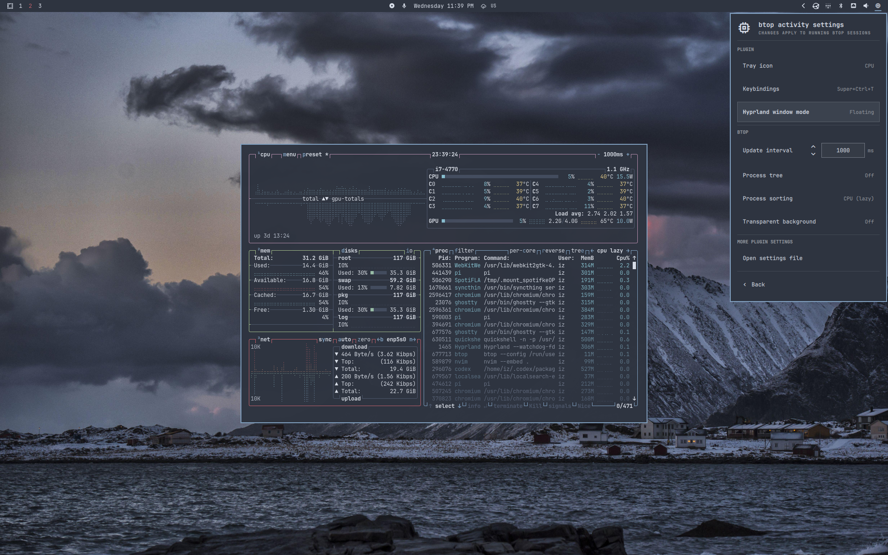

# btop activity for Omarchy

Brings btop back to the Omarchy bar, with CPU, RAM, GPU usage, VRAM and
temperature readings. In isolated tests on an Intel Core i7-4790, the widget
added roughly 10 MiB of RAM while idle; idle telemetry used about 0.2% of one
logical CPU.



## Demo

See btop launch from the bar, switch between floating and tiled layouts, apply a
250 ms refresh interval live, and open or close with a configurable shortcut.

<https://github.com/user-attachments/assets/5bb7eee8-c020-4e94-bcee-53794f928003>

### Features

- applies settings live to the running btop application
- preserves Omarchy's btop theme without touching the normal user `btop.conf`

## Quickstart

```bash
omarchy plugin add https://github.com/omarchy-QOL/omarchy-btop-activity --enable
```

The plugin starts with the information Linux already provides: CPU and RAM
usage, available temperature sensors, and any GPU readings exposed by your
driver. Omarchy already includes btop and Fastfetch. If GPU readings are
missing, see the [optional hardware setup](#optional-hardware-setup) for your
hardware. The plugin detects supported tools automatically.

After installation:

- **left-click** bar icon to start/close btop in the selected window mode
- **right-click** bar icon to open the plugin settings
  - choose **Settings** to change plugin and btop options
  - choose **Help** to open built-in help in the selected window mode
- **hover over it** to see RAM use, CPU use and temperature, and GPU use,
  temperature, and VRAM

## Settings

The plugin keeps a short list of useful controls before opening btop:

| Setting                | Choices                                  |
| ---------------------- | ---------------------------------------- |
| Tray icon              | Meters, CPU, Pulse, or a custom image    |
| Keybindings            | opens the Omarchy user bindings file     |
| Window mode            | floating or tiled                        |
| Update interval        | any whole number from 100 ms to one day  |
| Process tree           | on or off                                |
| Process sorting        | lazy CPU, direct CPU, memory, or program |
| Transparent background | on or off                                |
| More plugin settings   | opens the advanced settings file         |

For the update interval, press Enter or click the value to edit it. Left/Right
(or `h`/`l`) change it by 1 ms. Up/Down (or `k`/`j`) move through the presets in
[`settings.toml`](#settingstoml) while still letting you type any value in
btop's full range.

Plugin readings refresh while hovering over the icon or viewing its menu, then
pause when idle. That keeps things lean instead of constantly checking system
usage in the background.

Edit `~/.config/hypr/bindings.lua` directly, or select **Keybindings** in the
plugin settings to open it. Omarchy uses `Super+Ctrl+T` for ordinary btop. To
use `Super+Ctrl+Alt+G` for the plugin's toggle action instead, add:

```lua
hl.unbind("SUPER + CTRL + T")
o.bind("SUPER + CTRL + ALT + G", "Activity", os.getenv("HOME")
  .. "/.config/omarchy/plugins/ilyazar.btop/helpers/toggle-btop.sh")
-- for ordinary btop, comment out the two lines above and uncomment this:
-- o.bind("SUPER + CTRL + ALT + G", "Activity", { tui = "btop" })
```

Use `SUPER + CTRL + T` in `o.bind` to keep the original shortcut. For ordinary
btop instead of the plugin's toggle action, use `{ tui = "btop" }` as the last
argument.

The toggle shortcut follows the plugin's window mode and leaves ordinary btop
windows alone.

After Hyprland reloads, the settings row shows the effective shortcut, or
`Unbound` when no Activity binding remains.

Cycle **Tray icon** through **Meters**, **CPU**, **Pulse**, and **Custom**. The
custom path is stored separately, so switching between styles does not discard
it. For **Custom**, enter an absolute path, a `~/path`, or a `file://` URL, then
press Enter or **Save**. SVG and PNG both work. An invalid path shows `!`.

Depending on the installed icon themes, useful paths include:

- `/usr/share/icons/hicolor/scalable/apps/btop.svg`
- `/usr/share/icons/HighContrast/scalable/apps/utilities-system-monitor.svg`
- `/usr/share/icons/Yaru/scalable/apps/system-monitor-app-symbolic.svg`

Changes made in the settings menu are saved in Omarchy's `shell.json`.
Left-click behavior and interval presets use the optional `settings.toml` file
described below.

### settings.toml

Since v0.2.5, the plugin offers an optional user-owned settings file at
`~/.config/omarchy/ilyazar.btop/settings.toml`, respecting `XDG_CONFIG_HOME`.

At the bottom of the settings popup, **More plugin settings > Open settings
file** opens your copy in Omarchy's configured editor. If the file is missing,
this button offers the Yes/No prompt again. Plugin updates do not touch your
copy.

The shipped defaults are:

```toml
left_click = "toggle"
poll_intervals = [250, 500, 1000, 2000, 5000]
```

- `left_click`: `"toggle"` is the default and closes the plugin's btop window
  when it is already open; `"open"` launches or focuses instead. This affects
  only the bar icon's left-click. The popup's **start [b]top** action always
  opens or focuses btop
- `poll_intervals`: the preset ladder for the update-interval arrows, in
  milliseconds, not additional polling loops. Use a nonempty list of whole
  numbers between 100 and 86400000. Values are sorted and duplicates removed

Keep each setting on one line. Blank lines and `#` comments are supported;
omitted settings use their shipped defaults. Valid saves apply immediately,
without restarting the shell. Invalid values, duplicate keys, unknown keys, and
malformed entries show an error below the editor button and leave the session's
last valid settings unchanged. Removing the file restores defaults.

## Optional hardware setup

AMD Radeon, NVIDIA, and Intel graphics expose different information through
different tools. When a reading is missing, the plugin can use an installed tool
for that hardware to fill the gap. Installing one does not guarantee every
reading: some GPUs do not expose a separate temperature or dedicated video
memory.

See the [hardware setup guide](docs/optional_hardware_polling.md), also
available [on the website][hardware-guide].

[hardware-guide]:
  https://omarchyqol.com/docs/plugins/omarchy-btop-activity/hardware/

## Config safety and troubleshooting

The plugin stores popup choices in Omarchy's `shell.json` and advanced choices
in the user-owned `settings.toml` described above. It generates its private btop
config at `$XDG_RUNTIME_DIR/omarchy-btop-activity/btop.conf`. It verifies that
the runtime directory is available, user-owned, and writable before creating its
own private directory. The normal user `btop.conf` is never read or written.

The runtime file is created from Omarchy's packaged btop config. Quickshell
writes it atomically, and a running btop receives its supported config-reload
signal only after a successful change. If the file already exists, the plugin
reuses it and updates the btop settings stored in `shell.json`. Otherwise, it
creates the file when needed.

Omarchy plugins have no uninstall hook. Removing the plugin can leave this
temporary directory until the user runtime is cleared. That often happens at the
final logout and always happens on reboot; user lingering can delay it. The
leftover is harmless: normal btop never reads it, and reinstalling the plugin
reuses it. No marker or backup files are created.

GPU temperature and VRAM depend on driver support. If unavailable, the hover
says `--` or `-- (VRAM)`. See the hardware-specific
[setup instructions](#optional-hardware-setup) for optional tools, permissions,
and verification commands.

## Remove

```bash
omarchy plugin remove ilyazar.btop
```

Removing the plugin stops using its private btop settings. It does not remove
btop or change btop's normal configuration. Your advanced settings file is
preserved. The temporary generated btop config may remain until the user runtime
is cleared.

## Roadmap and releases

Planned work stays at the top. Shipped entries come from
[CHANGELOG.md](CHANGELOG.md), newest first.

| Release | Date       | What changed                                      |
| ------- | ---------- | ------------------------------------------------- |
| 0.2.5   | 2026-10-06 | open or close btop with one click or shortcut     |
|         |            | live user settings preserved across updates       |
|         |            | customize click behavior and interval presets     |
|         |            | pause telemetry when idle to reduce CPU use       |
|         |            | refresh GPU readings at the selected interval     |
|         |            | clearer shortcuts and keyboard menu navigation    |
|         |            | keep settings accessible after launching btop     |
|         |            | honor custom floating sizes and restore them      |
| 0.2.4   | 2026-09-20 | avoid GNU find crashes during GPU sampling        |
|         |            | keep scanner failures visible and tested          |
| 0.2.3   | 2026-09-13 | isolate and reuse a private runtime config        |
|         |            | compact settings and improve their navigation     |
|         |            | apply transparent backgrounds live                |
|         |            | show the identified default render GPU            |
| 0.2.2   | 2026-09-05 | native GPU telemetry without compiled helpers     |
|         |            | keep CPU and RAM sampling responsive              |
|         |            | show each GPU and distinguish VRAM/shared RAM     |
|         |            | document optional tools and Intel permissions     |
|         |            | align tooltip readings and compact legend         |
|         |            | keep popup and tray icons in sync                 |
|         |            | place interval arrows left of the input           |
|         |            | simplify the release table                        |
| 0.2.1   | 2026-09-02 | fix tooltip text and stream Intel GPU data        |
|         |            | keep Intel GPU sampling responsive at scale       |
| 0.2.0   | 2026-08-21 | simplify the release table                        |
| 0.1.10  | 2026-08-21 | allow any update interval or preset stepping      |
|         |            | restore settings on plugin disable or removal     |
|         |            | show Intel/NVIDIA GPU data after helper setup     |
|         |            | keep the widget readable on transparent bars      |
| 0.1.9   | 2026-08-15 | show GPU usage and temperature in hover/menu      |
|         |            | indicate unavailable GPU temperature              |
|         |            | fix Scroll Lock display in shortcuts              |
| 0.1.8   | 2026-08-14 | demo launch, window modes, refresh, and shortcuts |
| 0.1.7   | 2026-08-14 | update preview and explain Activity shortcuts     |
| 0.1.6   | 2026-08-14 | show the current Activity shortcut or Unbound     |
|         |            | place custom icon controls beside icon choice     |
| 0.1.5   | 2026-08-14 | open user bindings from settings                  |
|         |            | apply btop settings without plugin reload         |
|         |            | create private btop config if missing             |
| 0.1.4   | 2026-08-13 | keep settings usable while private config loads   |
|         |            | switch open btop windows: floating or tiled       |
|         |            | add the 250 ms interval                           |
| 0.1.3   | 2026-08-13 | use Omarchy's btop config and current theme       |
| 0.1.2   | 2026-08-12 | isolate plugin settings and clean up on removal   |
| 0.1.1   | 2026-08-12 | show CPU temperature in hover details             |
|         |            | refresh hover data at the chosen interval         |
|         |            | default to the CPU icon for new installs          |
| 0.1.0   | 2026-08-12 | first release                                     |

## Development

Edit the checkout used by the installed plugin, then validate and reload it:

```bash
cd ~/.config/omarchy/plugins/ilyazar.btop
omarchy plugin validate .
omarchy-shell shell rescanPlugins
```

If a reload still shows an old component, run `omarchy restart shell`.

## License

MIT
